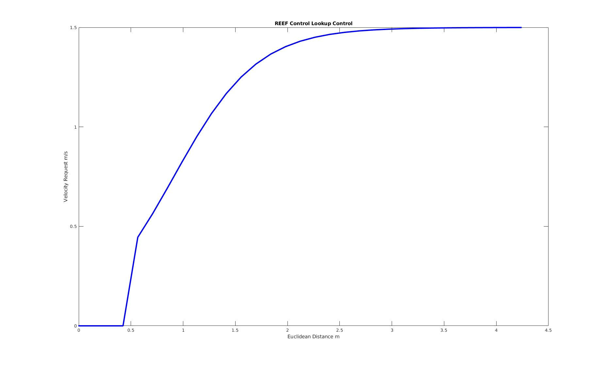
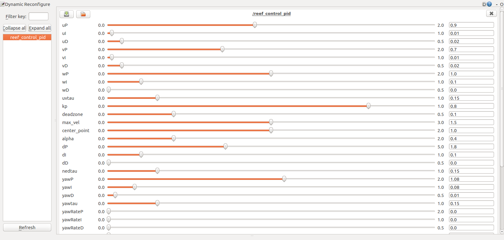
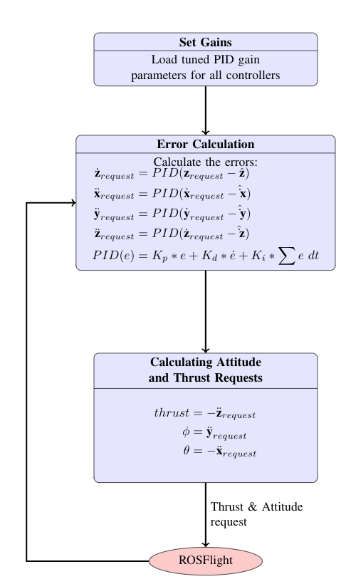

# REEF Control
The REEF Control package contains a set of simple cascading PID controllers designed to enable attitude, velocity, and position control. The package was originally intended for a PID controller using the REEF Estimator but can be easily integrated with other estimators and other controllers. 

Another feature of this package is that it enables the user to tune the gains of the PID controller dynamically.  
**All components are expressed in the NED frame since ROSFlight expects the attitude command in that frame**
## Prerequisites
Requires [ROS Melodic](http://wiki.ros.org/melodic/Installation), [ROSFlight](https://docs.rosflight.org/user-guide/ros-setup/) and the [REEF_msgs](https://github.com/uf-reef-avl/reef_msgs) package to be installed. Additionally, the package depends on the [dynamic_reconfigure](http://wiki.ros.org/dynamic_reconfigure) package.
For REEF Estimator feedback, [REEF Estimator](https://github.com/uf-reef-avl/reef_estimator) should be installed. For REEF Teleop control, [REEF Teleop](https://github.com/uf-reef-avl/reef_teleop) should be installed.

## Backgroud
The REEF Estimator was designed only to function as a controller, it takes in a desired position, velocity, or attitude mesurement and converts them to a commanded attitude expected by the ROSFlight module. This node will not decide the mode of operation, it expects the desired_state message to convey that to the controller. There needs to be a higher level node that publishes the desired state (eg. [reef_teleop](https://github.com/uf-reef-avl/reef_teleop), [dubins_path](https://github.com/uf-reef-avl/dubins_path) or [setpoint_generator](https://github.com/uf-reef-avl/setpoint_publisher)  )

The desired_state message supports position command, velocity commands, attitude commands, and an altitude hold mode which can be controlled by the relevant switches in the message. The package does **NOT** use a PID loop for the position control, but rather uses a lookup table. From prior experience, we have always liked having the altitude (Z and Z_dot) controller running in all modes, so these two controllers will always function in ALL modes. 

### Lookup Table Control
In a cascading PID loop, the position command is converted to a velocity command which is then further converted to a attitude command. Since position and velocity commands have a "simple" and "intutive" relationship if the desired position is to the left of the vehicle, the body frame velocity will also point to the left. A lookup table is preferred in comparision to a PID loop in this situation.
The control law is extremely simple: unless you are within a certain threshold distance from the desired position a constant velocity is applied, if you are within the threshold the velocity is gradually decreased (the decrease is modelled like a sigmoid function). 
The equation is given by:

 

The figure below is a plot of the velocity request as a function of time 
. 

The characteristics of the curve can be altered using the *deadzone*, *kp*, *center_point*, *alpha*, and *max_velocity* parameters. A [MATLAB script](./scripts/configure_lookup_table.m) can be used to visualize the commands prior to implementation.

## Installation
Simply clone **reef_controller** to the catkin workspace src directory and compile it to make sure everything works.
```
sudo apt-get install ros-kinetic-dynamic-reconfigure
cd catkin_ws/src
git clone https://github.com/uf-reef-avl/reef_control
cd ../ && catkin_make
```
## Usage

### REEF Control node:
The reef control node subscribes the following topics:
 * /desired_state [reef_msgs/DesiredState]* - Contains the desired states for the controller
 * /is_flying [std_msgs/Bool]* - Tells if the quad is flying. Helps set the *initialized* flag
 * /pose_stamped [geometry_msgs/PoseStamped] - Position estimates (ideally from a motion capture system)
 * /rc_raw [rosflight_msgs/RCRaw] - RC Messages, used to switch between modes.
 * /status [rosflight_msgs/Status]* - Status of flight controller to tell if the vehicle is armed
 * /xyz_estimate [reef_msgs/XYZEstimate]* - Estimates used to get Z and XY Velocity estimates
 
 **Topics denoted with a ```*``` are requred. All others are optional.**

The node publishes the following messages:
* /command [rosflight_msgs/Command] - Desired attitude commands
* /controller_state [reef_msgs/DesiredState] - Internal results of the PID loops

There are two other topics from the dynamic reconfigure package which are not relevant. 

### ROS Launch Usage
The REEF Controller is designed to be executed from a launchfile, **reef_controller** should be the name of the node, the package, and the type. For example,
```xml
<node name="reef_controller" pkg="reef_controller" type="reef_controller" output="screen"/>
```
In order to launch this node you MUST also load a the max_roll, max_pitch, max_yaw_rate and hover_throttle parameters. **The node will not run unless these parameters are loaded**. For the PID loop the work the gains must be loaded through a .yaml file.

## Parameters
The internal PID controllers can be tuned by setting the gain and output clamp values in **reef_controller/params/$(vehicle)_pid.yaml**. An example YAML file looks like the following:
```xml
reef_control_pid: {
    kp: 0.8, deadzone: 0.1, max_vel: 1.5, #params for sigmoid
    center_point: 1.0, alpha: 0.4, #params for sigmoid
    uP: 0.9, uI: 0.01, uD: 0.02, #body_frame x velocity
    vP: 0.7, vI: 0.01, vD: 0.02, #body_frame y velocity
    wP: 1.0, wI: 0.1, wD: 0.0, uvtau: 0.15, #body_frame z velocity
    dP: 1.8, dI: 0.1, dD: 0.0, nedtau: 0.15, #body_frame z
    yawP: 1.08, yawI: 0.08, yawD: 0.01, yawtau: 0.15, #yaw
    xIntegrator: 1,
    uIntegrator: 1,

    max_roll: 0.25,
    max_pitch: 0.25,
    max_yaw_rate: 2.0,
    max_u: 1.0,
    max_v: 1.0,
    max_w: 1.0,
    max_d: 1.0,

    face_target: false,
    fly_fixed_wing: false
}
```

As explained in the [lookup table](###Lookup Table Control) section the parameters on the first two lines help characterize the sigmoid function.
The u(PID), v(PID), w(PID), d(PID) and yaw(PID) are the PID gains for the body frame x,y,z velocities, altitude and yaw respectively.
*hover_throttle* is the percentage thrust required to keep the vehicle in a stable hover. The max parameters are set subsequently. 

*face_target* parameter is used to decide if you want the vehicle heading to face the next waypoint, *fly_fixed_wing* is used make a multirotor platform "fly like a fixed wing vehicle" where instead of a hovering and yawing, there will be a slight forward velocity as it yaws.

## Dynamic Tuning
Dynamic tuning has been used in our lab in order to tune the PID gains while the vehicle is in flight. When using this, please exercise caution as drastic changes to certain gains can lead to crashes. 

The dynamic tuning uses the yaml parameters as the default values. Hence the gains are launched using a namespace which is the SAME as the name of the node (refer to launch file). If this is NOT the case all the gains will be set to the default value in the [configure](./cfg/Gains.cfg) file. Please refer to the [tutorial](http://wiki.ros.org/dynamic_reconfigure/Tutorials/HowToWriteYourFirstCfgFile) for the dynamic configure for more details.

### Tuning the Gains:
1) Enable a ground station to communicate with the ROS Master which is running on the vehicle's on-board computer. Refer to this [tutorial](http://wiki.ros.org/ROS/Tutorials/MultipleMachines) to implement this. To test this is working, run roscore on the vehicle and check if you can see the topics on the ground station. 
2) Once Step 1 works, launch the REEF_control node on the vehicle (ideally using SSH)
3) On the ground station (which is connected to the ROS Master), run
```xml
rosrun rqt_reconfigure rqt_reconfigure
```
Then, the following window will open up:



Move the gains to get the desired performance and once satisfied, copy the parameters to the yaml file. The gains do not get copied over automatically, you need to copy them manually. If you close the window they will get erased. 

From experience, it is recommended that you start with tuning the altitude (d and w) since it is the easiest axis to tune. 
## Flowchart


## Notes

The point of REEF_control is to have a simple system that works. This does not do anything fancy like go through doorways or [play the piano](https://www.ted.com/talks/vijay_kumar_robots_that_fly_and_cooperate?language=en). The user has to take into considersation some issues while using/tuning the controller such as:
1) The performance of the controller is highly dependent on the battery level since the hover throttle parameter changes depending on the battery level.
2) In vehicles with low inertia, the battery placement is really critical. If you tune you controller using one placement and then change the battery it is highly likely that the gains will have to be changed. So when building your vehicle see if you can ensure constant and stable battery placement.

The code is intended to be as modular as possible. If you do not like the PID controller, you can design your own controller and replace just PID.cpp. 

This package is an adoptation of a similar package developed by BYU's Magicc Lab. 

